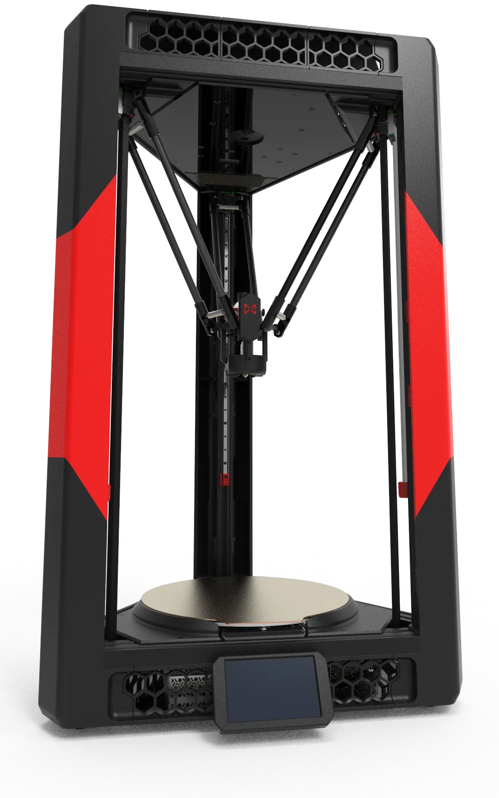

## 什么是 Venture Delta？

Venture Delta是一款采用Delta运动学结构，圆柱形打印面积(Ø300 × 330 mm)的中等尺寸高速3D打印机套件，是一台借鉴了包括但不限于[Doron-Velta]、[VoronDesign](https://github.com/VoronDesign)、[Kossel](https://github.com/jcrocholl/kossel)、[Annex Engineering](https://github.com/Annex-Engineering)团队与社区混合产品，最初为打造一台Voron风格的Delta结构的3D打印机而诞生，将其作为[Doron-Velta]的一个分支，并已得到了作者[Rogerlz](https://github.com/rogerlz)的授权。

[Doron-Velta]:https://github.com/rogerlz/Doron-Velta

秉承“经久耐用”的设计理念，其关键部件采用高精度数控加工零件，9MM宽度的皮带与6AWD全轮驱动，3030与2040高品质铝型材组成的高刚性结构，精密运动控制系统，以及优化过的CPAP远程送风散热与金属轻量化传动模块使其不仅打印速度快、构建尺寸大，具备卓越稳定性与可靠性且依托开放的生态及硬件的通用可替换性，使其自身维护需求极低，更换成本极低。

这是一台典型的Delta运动学3D打印机,三角框架相比方形将更加稳固，因三个角均相同，使其在装配难度上大幅降低，如果您是一位资深Voron3D打印机玩家，您将感受到前所未有的装配舒适度。相比其他3D打印机结构，所有的运动均由三个电机同时运动所产生，使其在速度方面具有与生俱来的优势（Corexy结构是两个电机同时运动、Cartesian结构是一个电机带动一个轴运动）。非运动的固定的平台设计与高精度的光电传感器，使您在完成校准后无需重复校准，可直接进行打印而无需等待，节省打印等待时间，最后她的运动是优雅且解压的，欣赏这台优美的Delta运动学3D打印机的打印过程,会让您释放压力，感觉舒适。

配备550MHz H723单芯片微型计算机，并为此单独设计了4核A53工业级处理器、DDR4内存 + 16GB固态存储、5英寸高清电容触摸屏，仅需一根连接线即可实现通信与供电。不仅带来极快的装配与打印体验，还能让您操作时感觉舒适。

所有非结构件均采用3D打印设计且本机自身均能完成打印，可兼容与适配多种扩展模块与打印组件，依托开放的生态与社区支持，使其成为一台可无限进步而不是需重复购买的Delta运动学3D打印机，您可以将其打造成为独属于您的独一无二的3D打印机。

同时这个设计还预留封箱扩展，可后期升级封箱且不会影响打印面积，为进一步需求预留了丰富的扩展空间，提供了广泛的升级和改装空间，极具可玩性。无论您追求更高性能还是个性化定制，都能在这里找到满足感。
    {.img1}

## 构建您的 Venture Delta：

借助Venture Delta DIY套件，您将有机会亲手组装一台功能强大的Delta运动学高速3D打印机!

这是一次充满乐趣的周末搭建体验（与孩子们一起），在这里配有友好的针对初学者的精美的[指导说明](https://micromake.github.io/delta/1/1/)。

选择这套套件开启您的3D打印之旅，跟随众多爱好者的脚步，全面了解Delta运动学3D打印机的内部构造。

无论您是初次接触3D打印还是经验丰富的专家，Venture Delta都能满足您对一台高速可靠的全能型机器的所有需求。
    {.img1}

## Venture Delta 有什么？

### 电器介绍

- 四核 1.5G A53工业级处理器 （最高工作承受温度110度）
- 配备DDR4内存 + 16GB固态存储且内置WiFi上位机
- Spider 3.0 下位机（550Hz H723芯片）
- 300W交流控制热床（具备过热保护功能）
- 万转CPAP远程送风风扇及驱动板
- 6驱动高速电机（一体同步轮）
- 5寸高清电容触摸屏
- 高精度光电传感器
- 高功率固态继电器
- 耐高温挤出机电机
- 自动调平传感器
- 高品质开关电源
- 高速电机驱动板
- 免焊接防呆线

### 机械介绍

- 3030+2040铝型材框架
- 9MM宽度耐磨盖茨皮带
- 12MM高品质直线导轨
- 金属CNC加工连接件
- 金属CNC传动连接件
- 金属CNC加工并联臂
- 金属CNC吊台与背板
- 金属加工球头连接件
- 高流量打印头组件
- 5MM厚圆形铝平台
- 磁性PEI弹簧钢板
- 所有五金均分类
- 底部固定板
- 顶部固定板
- 电机减震垫
- 脚垫与钢珠
- 黑色送风管
- 黑色波纹管
- 黑色四氟管

### 工具介绍

- 热熔螺母压头套件
- 内六角扳手套装
- 喷嘴疏通针套装
- 喷嘴清理刷
- 四氟管切刀
- 线轨润滑油
- 球头润滑脂（没有可用凡士林替代）
- 固态胶棒
- 电烙铁
- 呆扳手
- 螺丝刀
- 斜口钳
- 螺纹胶
- 镊子
- 扎带

## 开始打印 Venture Delta！

## Venture Delta 改造开始！

## 特别鸣谢 Venture Delta：

## Venture Delta 升级计划：
