## 0.注意事项
!!! warning "注意事项"
    框架安装不建议使用电动工具，过大的扭力会导致螺丝损坏，无法拆卸。
    {.img1}
    角件位置请按照如图所示安装：
    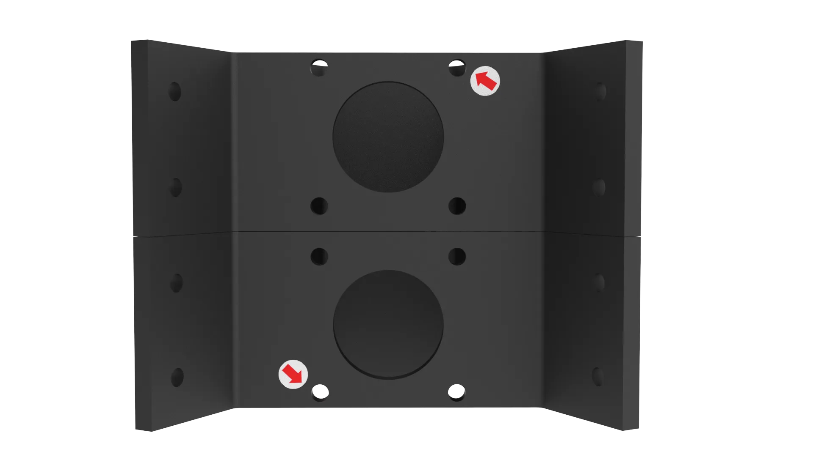{.img1}
    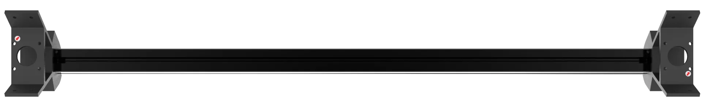{.img1}

!!! info "螺丝固定"
    螺丝需要涂抹螺纹胶：
    {.img1}
    注意<strong>M4垫圈</strong>的安装方向，需要涂抹螺纹胶的螺丝使用<strong>蓝色</strong>显示：
    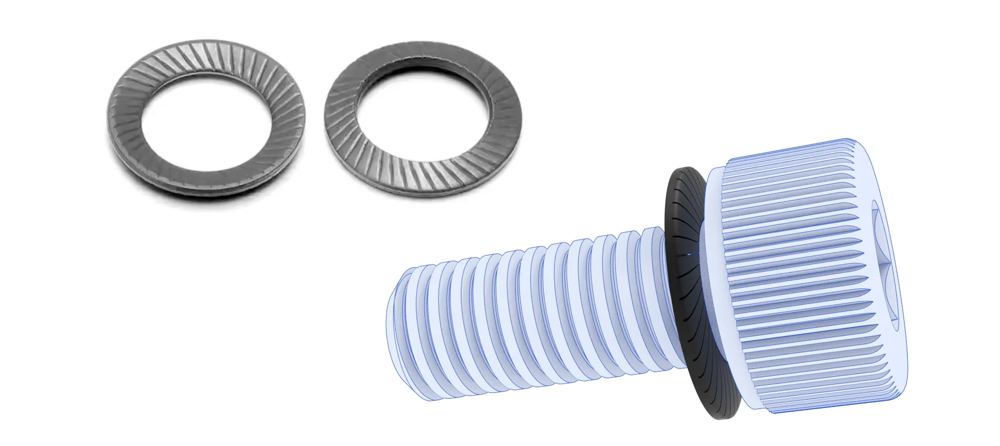{.img1}

???+ tip "安装建议"

    请在平整的桌面或地面进行安装：
    {.img1}

## 1.立柱组装

### 所需物料

1.金属角件 * 6
   {.img1}
   
1.长铝型材 * 3
   {.img1}

2.M4垫圈 * 6
   {.img1}

3.M4*10 杯头螺丝 * 6
   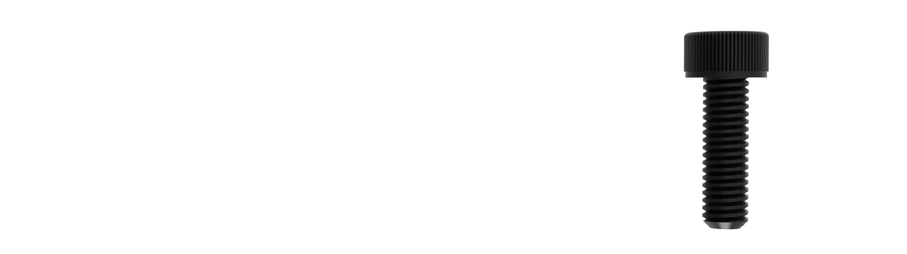{.img1}

4.船型螺母30型-M4 * 6
   {.img1}

### 组装流程

1.将<strong>M4*10 杯头螺丝</strong>套入<strong>M4垫圈</strong>，涂抹上<strong>螺纹胶</strong>，如图所示（注意<strong>M4垫圈</strong>的方向）。
   {.img1}

2.穿入<strong>金属角件</strong>如图所示位置。
   {.img1}

3.并拧上<strong>船型螺母30型-M4</strong>，不要拧紧，拧上即可。
   {.img1}
   
4.穿入<strong>长铝型材</strong>，并拧紧两颗<strong>M4*10 杯头螺丝</strong>，<strong>长铝型材</strong>应与<strong>金属角件</strong>齐平，不要超出<strong>金属角件</strong>。
   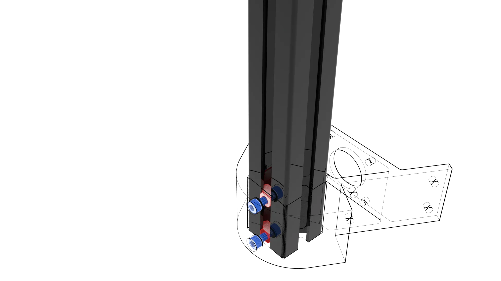{.img1}

5.相同的安装方法将<strong>金属角件</strong>固定到另一端，注意<strong>金属角件</strong>的位置,两个<strong>金属角件</strong>距离应为<strong>750MM</strong>。
   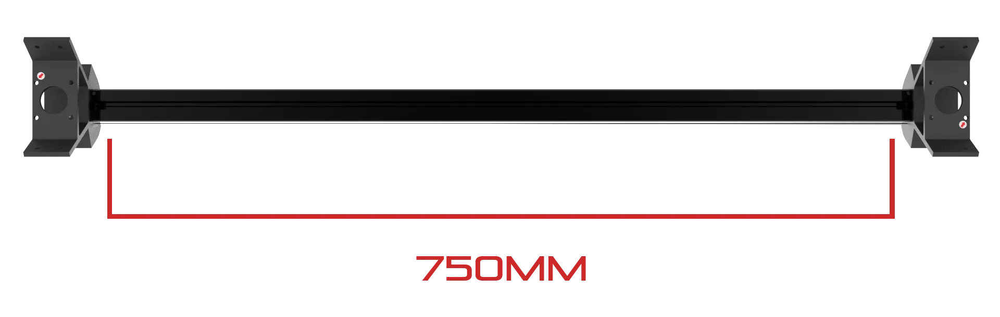{.img1}

6.另外两根安装方法相同。
   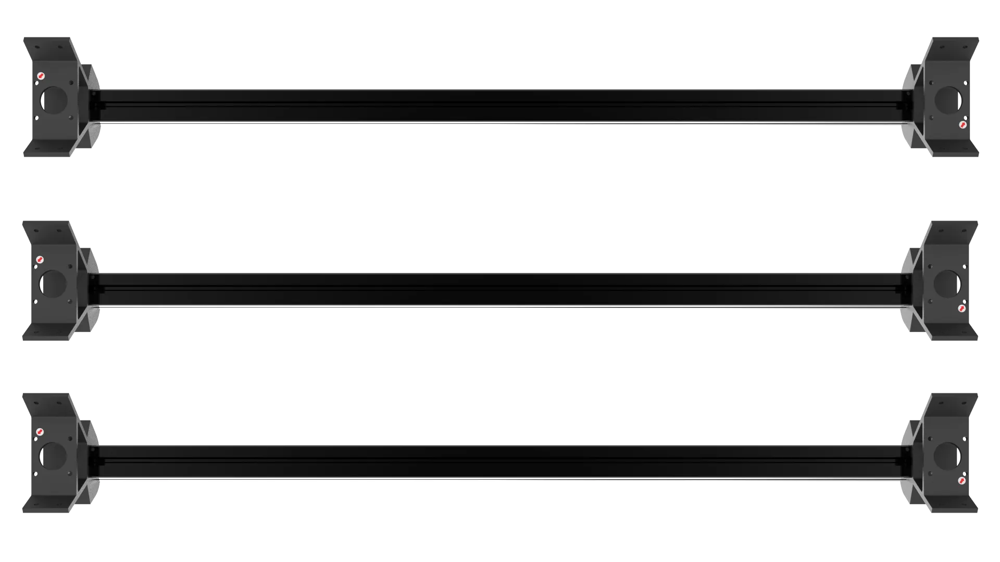{.img1}
   
## 2.横梁组装

### 所需物料

1.短铝型材 * 6
   {.img1}

2.M4垫圈 * 12
   {.img1}

3.M4*10 杯头螺丝 * 12
   {.img1}

4.船型螺母20型-M4 * 12
   {.img1}

### 组装流程

1.组装横梁时，为保证<strong>短型材</strong>平行，建议在平整的桌面或地面上进行组装。
   {.img1}

2.将<strong>M4*10 杯头螺丝</strong>套入<strong>M4垫圈</strong>，涂抹上<strong>螺纹胶</strong>，如图所示（注意<strong>M4垫圈</strong>的方向）。
   {.img1}

3.穿入<strong>金属角件</strong>,并拧上<strong>船型螺母20型-M4</strong>，不要拧紧，拧上即可,如图所示位置。
   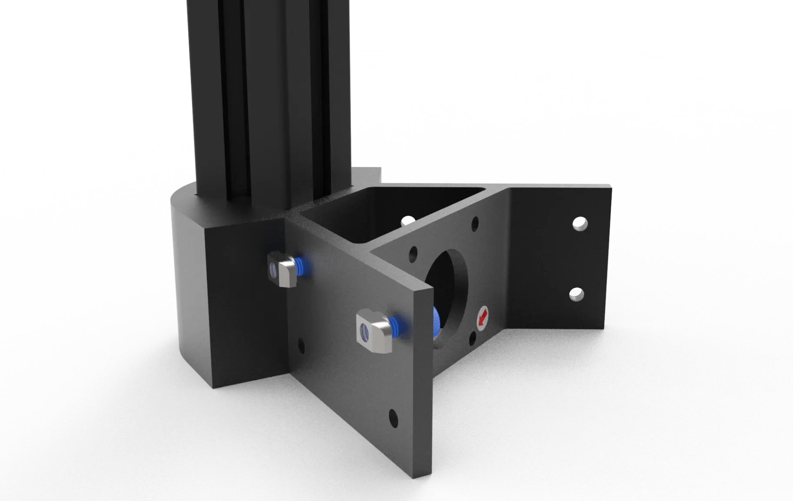{.img1}

4.为方便安装，将两根<strong>短铝型材</strong>，如图所示摆放。
   {.img1}
   
5.将<strong>短铝型材</strong>推入到上方的<strong>短铝型材</strong>的卡槽中，如图所示。
   {.img1}

6.此时<strong>短铝型材</strong>光面应朝外。
   {.img1}

7.夹紧并调整好后，先拧好角件内侧位置的<strong>M4*10 杯头螺丝</strong>，尝试滑动，确保拧到位，拧好后<strong>短铝型材</strong>不会松动滑落。
   {.img1}

8.确保拧到位后，再拧紧另一颗<strong>M4*10 杯头螺丝</strong>，确保固定的足够紧并稳固，保证高速运动时角件与型材的螺丝不会松动。
   {.img1}

9.<strong>船型螺母20型-M4</strong>正确的安装应如图所示。
    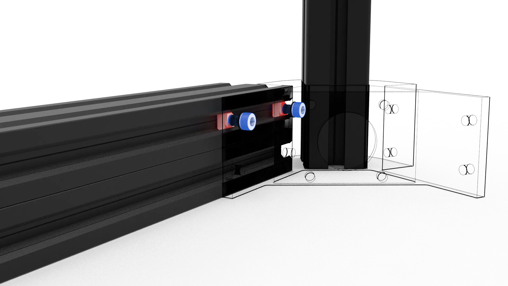{.img1}

10.另外一边安装方法相同，如图所示。
    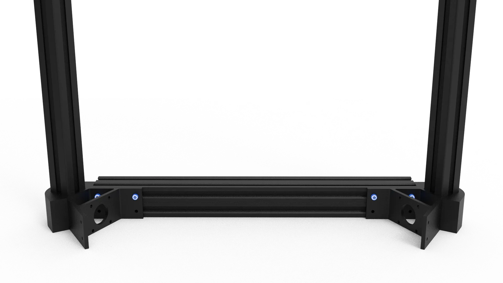{.img1}

11.注意所有的显示蓝色的<strong>M4*10 杯头螺丝</strong>都需要套入<strong>M4垫圈</strong>，涂抹上<strong>螺纹胶</strong>,底部安装完成后如图所示。
    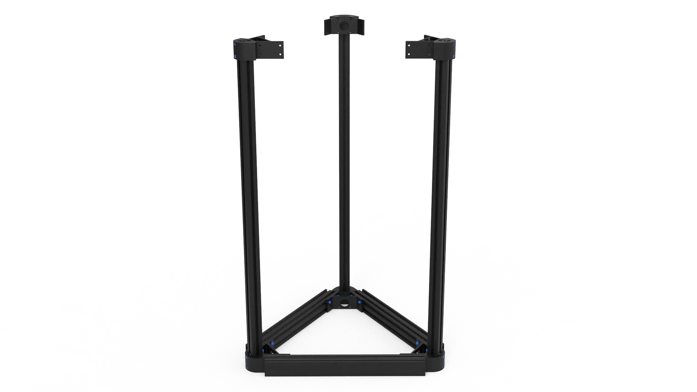{.img1}

12.顶部安装方法相同，<strong>短型材</strong>固定在<strong>金属角件</strong>下方，如图所示。
    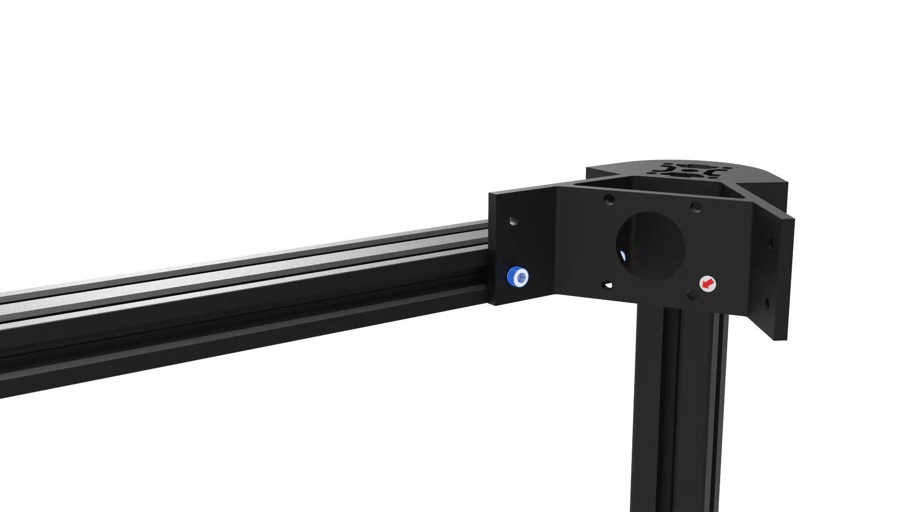{.img1}

13.最后依次检查所有螺丝并再次拧紧，确保整个框架的螺丝均拧紧，具有一定刚性，安装完成后如图所示。
    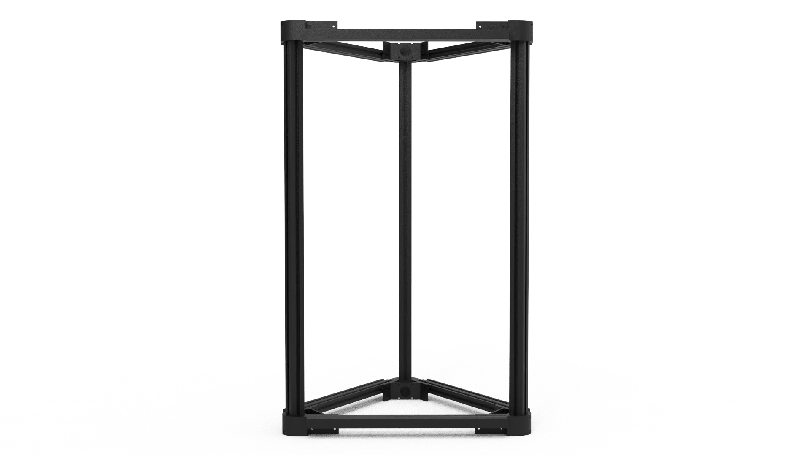{.img1}
  
## 3.电机组装

### 所需物料

1.步进电机* 6
   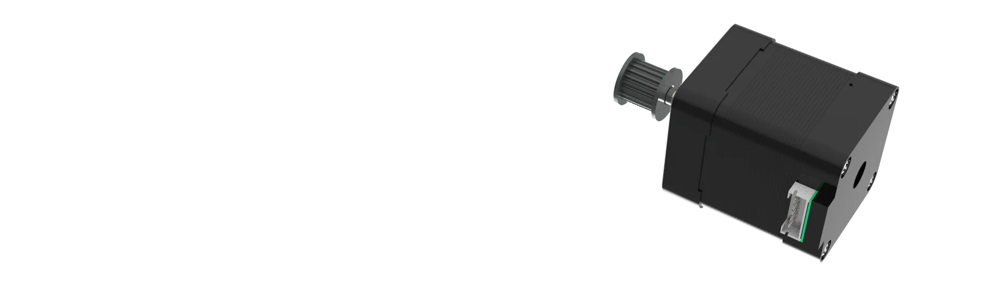{.img1}

2.减震垫 * 6
   {.img1}

3.M3*10 杯头螺丝 * 12
   {.img1}

### 组装流程

1.将<strong>步进电机</strong>如图摆放并套上<strong>减震垫</strong>，如图所示。
   {.img1}

2.将四颗<strong>M3*10 杯头螺丝</strong>穿过<strong>金属角件</strong>与<strong>减震垫</strong>固定到<strong>步进电机</strong>上，如图所示。
   {.img1}
   
3.如果安装正确，<strong>步进电机</strong>将略高于<strong>金属角件</strong>，请注意<strong>步进电机</strong>线的方向，无需拧紧，<strong>步进电机</strong>与<strong>减震垫</strong>无间隙即可,应如图所示。
   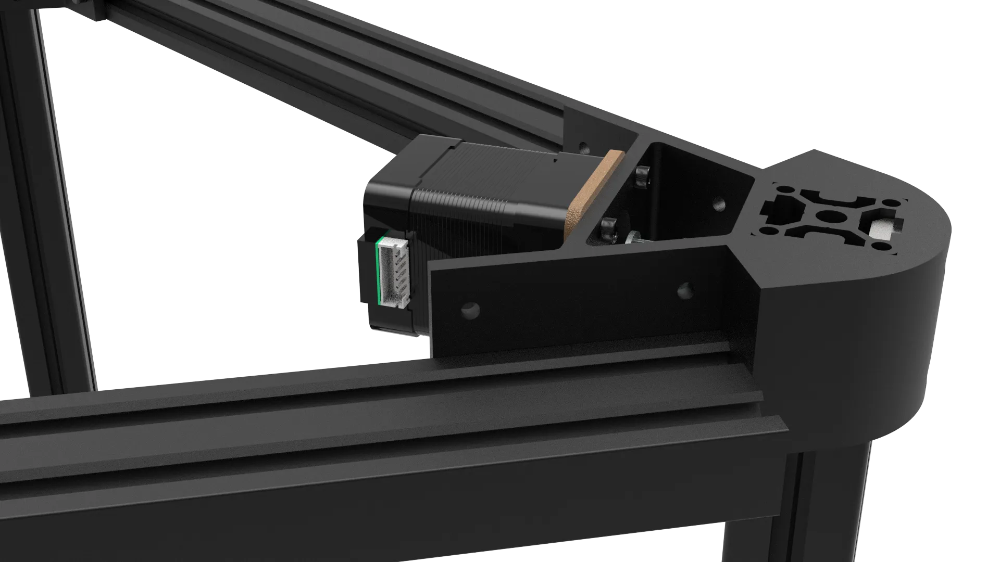{.img1}

4.另外两组安装方法相同,如图所示。
   {.img1}

5.反转框架进行下面三组的安装，安装方法相同，如图所示。
   {.img1}

!!! warning "注意"
    为保证整个打印框架的机身刚性，建议上胶后静置24小时后再进行打印，确保螺纹胶完全凝固。

???- faq "FAQ"

    **Q: 为什么固定角件需要增加垫片？**

    **A:** 金属角件加金属螺丝与螺母在高速高频震动场景中极易松动，产生螺丝松动及脱落问题，增加垫片其主要目的为防松、防回弹、防松动间隙的作用。

    **Q: 为什么垫片有正反？**

    **A:** 采用碟簧加双面齿防滑垫圈的作用主要针对金属对金属锁紧、会震动、会受热、会松脱的应用场景，上下两面都有齿纹一旦拧紧，齿会轻微嵌入金属，任何震动都转不动螺母加上本身是锥形碟簧结构，有预紧力，在零件受热膨胀、冷却收缩、接触面轻微压溃、磨损、长期震动导致间隙，都能持续保持压紧力，锁紧后几乎永不松脱，请安装时特别注意垫片安装方向，错误的安装会导致弹性不对、预紧力变小与不稳定的问题，当松掉螺丝需重新安装时建议更换垫片。

    **Q: 螺丝为什么要打螺纹胶？**

    **A:** 打胶的目是为靠化学固化，把螺纹 “粘住”，拧紧时有润滑作用，力矩更稳定，高温下不咬死、填满螺纹间隙，防潮、防氧化、防锈蚀，有轻微弹性，能保持锁紧力不衰减，建议使用乐泰的243螺纹胶，中强度7N，可以拆卸。

    **Q: 还能打其他胶么？**

    **A:** 如果不考虑拆卸，可以使用乐泰的270或271高强度红胶，如果上螺丝时忘记打胶，不像拆卸可使用渗透型绿胶进行补强。

    **Q: 为什么选择船型螺母？**

    **A:** 固定的方法有很多种，没有选择打孔或者攻丝固定的原因主要考虑成本与扩展性，打孔成本高切精度不易保障，型材后期再利用率低，使用船型螺母因成本低廉且容易拆装，选择不可拆卸的方形螺母会造成不易拆装的问题，选择成本更高的不锈钢弹簧螺母，没有实际意义，保障机身刚性起绝对作用的是垫片加胶水而不是螺丝本身，而选择高强度的螺丝是为了保障可拆卸性。

    **Q: 角件上的预留孔有什么用？**

    **A:** 因为是全金属结构，使用单边固定即可满足强度需求，预留孔用相同方法也能安装一组常见的的欧标2020、1515、1020铝型材，不会影响任何打印件，可以增加自身强度与刚性，如果需要扩展横梁长度增加打印面积，建议安装更多的铝型材。

    **Q: 这个框架有什么优点？**

    **A:** 使用本教程安装的方法安装的框架有着机架的机身刚性与稳定性，立柱型材从2020铝型材加强至3030铝型材进一步提高了自身刚性，可以安装六个电机。角件预留扩展孔位可以增加型材再次提高自身刚性，无需打孔攻丝对型材加工要求低（紧需保证横梁型材切割尺寸一致性即可），成本低，扩展性强，增加或减少横梁长度改变打印尺寸，增加或减少立柱长度改变打印高度，装配简单，三边相同，三角稳定性优于方形，对装配要求低。