## 0.注意事项

!!! info "螺丝固定"
    螺丝需要涂抹螺纹胶,  需要涂抹螺纹胶的螺丝使用<strong>蓝色</strong>显示：
    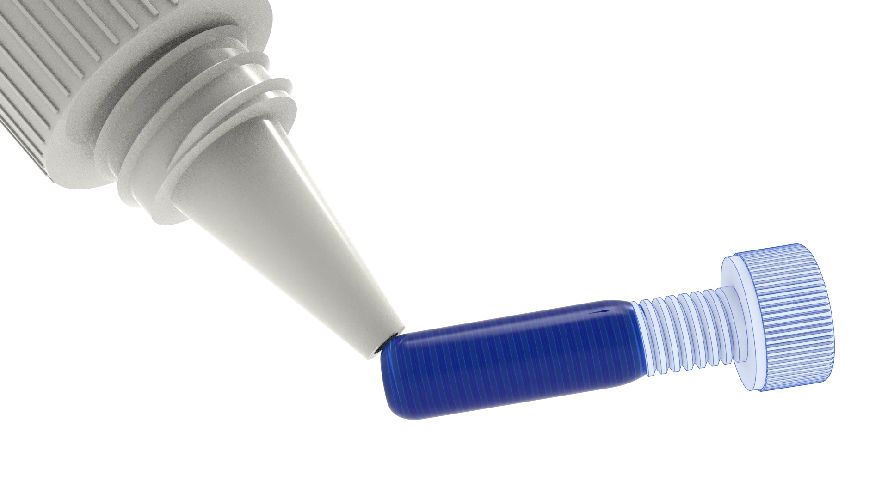{.img1}
    
   
???+ tip "安装建议"

    安装导轨时，建议佩戴手套。
    {.img1}
    建议在平整的桌面进行安装。
    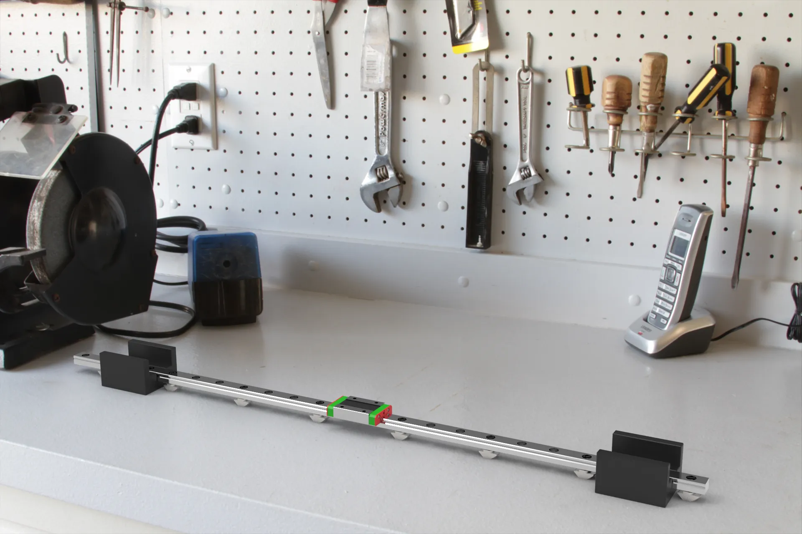{.img1}

## 1.导轨组装

### 所需物料

1.直线导轨 * 3
   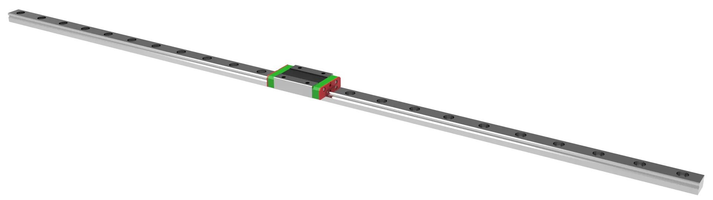{.img1}

2.M3*10 杯头螺丝 * 24
   {.img1}

3.M3*14 杯头螺丝 * 3
   {.img1}

4.船型螺母30型-M3 * 27
   {.img1}

### 打印零件

1.[导轨定位件] * 2
[导轨定位件]: dy1.stl
   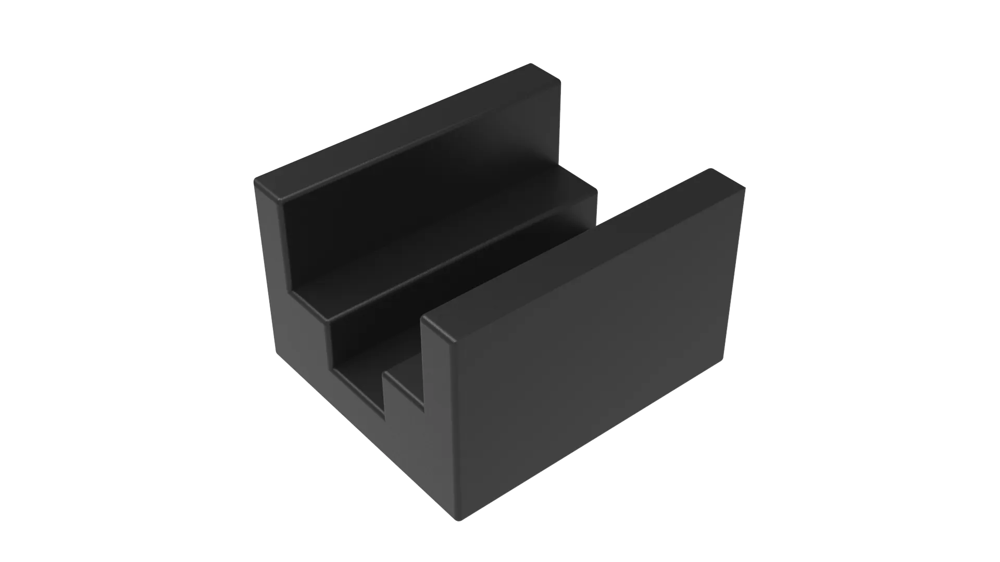{.img1}

2.[导轨防脱块] * 3
[导轨防脱块]: dy2.stl
   {.img1}

### 组装流程

1.拿出<strong>直线导轨</strong>使用两个<strong>导轨定位件</strong>将导轨撑起，使用<strong>M3*10 杯头螺丝</strong>穿过导轨，从上往下每隔两个孔安装一颗，总计八颗(建议在干净的桌面上操作)。
   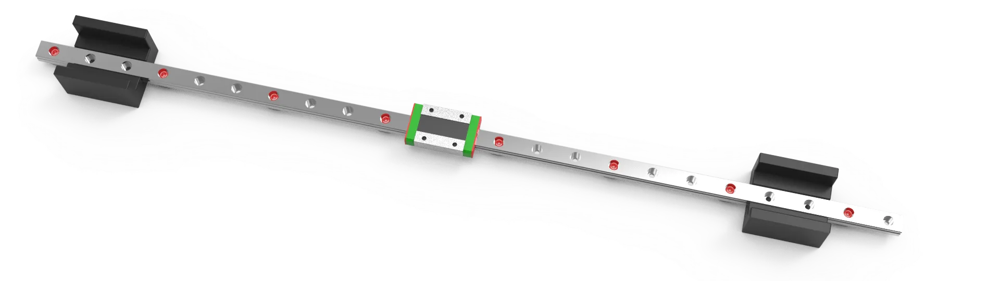{.img1}

2.在导轨处套入<strong>导轨防脱块</strong>使用<strong>M3*14 杯头螺丝</strong>穿过导轨。
   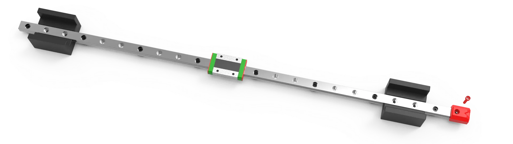{.img1}

3.拧上九颗<strong>船型螺母20型-M3</strong>，不要拧紧，拧上即可。
   {.img1}

4.将<strong>直线导轨</strong>放入<strong>长型材</strong>上，<strong>船型螺母20型-M3</strong>应在槽内，使用两个<strong>导轨固定件</strong>辅助型材左右定位，防止滑块脱落，<strong>导轨防脱块</strong>在下方固定,如图所示。
   {.img1}
   
5.拧紧<strong>M3*10 杯头螺丝</strong>，确保所有<strong>船型螺母20型-M3</strong>全部卡到<strong>长型材</strong>槽内，安装完成后滑动<strong>直线导轨</strong>上的滑块，确认是否顺滑没有卡顿，可适当加入润滑油使滑块运动顺畅，最后取出<strong>导轨定位块</strong>，如图所示。
   {.img1}

6.另外两根安装方法相同。
   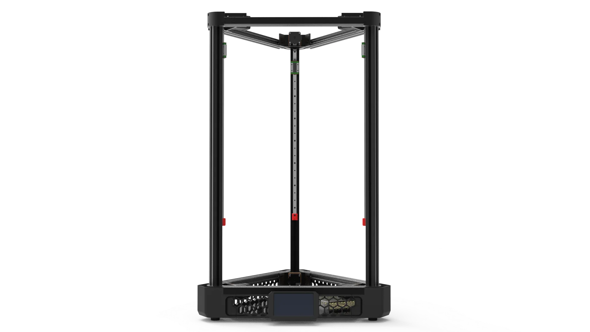{.img1}
   
## 2.滑块组装

### 所需物料

1.金属连接滑块 * 3
   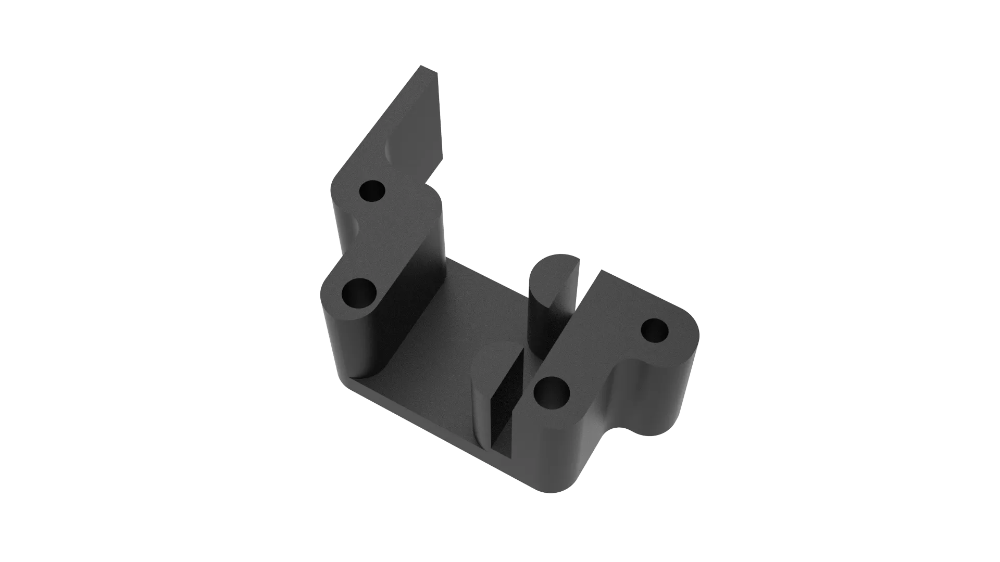{.img1}

2.金属球头连接件 * 3
   {.img1}

3.2GT开口同步带 * 3
   {.img1}

4.扎带 * 12
   {.img1}

5.M3*14 杯头螺丝 * 6
   {.img1}

6.M3*20 杯头螺丝 * 6
   {.img1}

### 打印零件

1.[滑块垫片] * 3
[滑块垫片]: dy3.stl
   {.img1}

2.[滑块装饰块] * 3
[滑块装饰块]: dy4.stl
   {.img1}

### 组装流程

1.将<strong>2GT开口同步带</strong>穿过两个<strong>步进电机</strong>，两端分别套到<strong>步进电机</strong>同步轮的槽内，如图所示。
   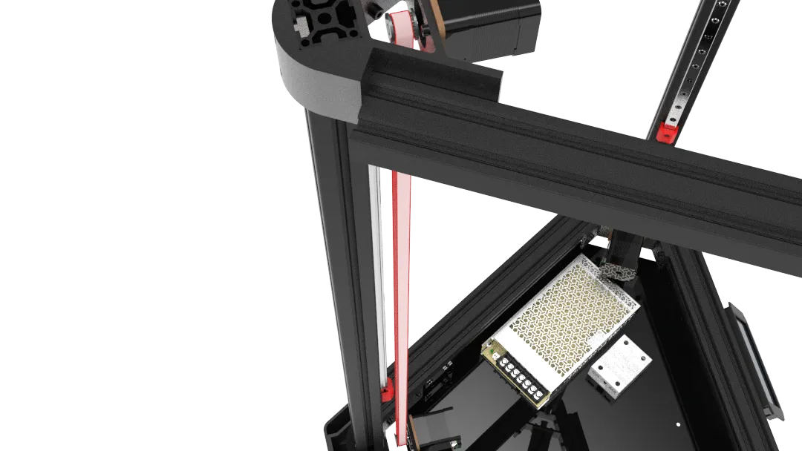{.img1}
2.将<strong>2GT开口同步带</strong>的两端绕到<strong>金属连接滑块</strong>中，使用<strong>扎带</strong>将扎紧，并减去多余的部分，如图所示。
   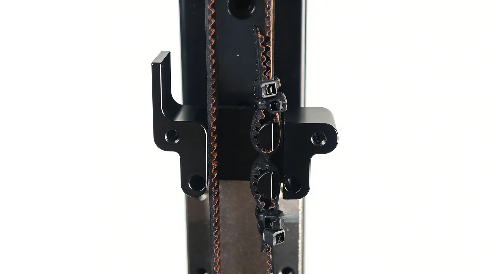{.img1}

3.使用两颗<strong>M3*20 杯头螺丝</strong>穿过<strong>滑块垫片</strong>与<strong>金属连接滑块</strong>后固定到<strong>直线导轨</strong>的滑块上，需拧紧,如图所示。
   {.img1}
   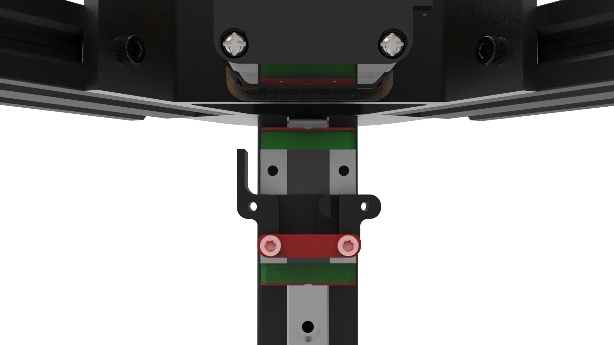{.img1}

4.使用两颗<strong>M3*14 杯头螺丝</strong>穿过<strong>滑块垫片</strong>与<strong>金属连接滑块</strong>，涂抹上<strong>螺纹胶</strong>后固定到<strong>直线导轨</strong>的滑块上，需拧紧,如图所示。 
   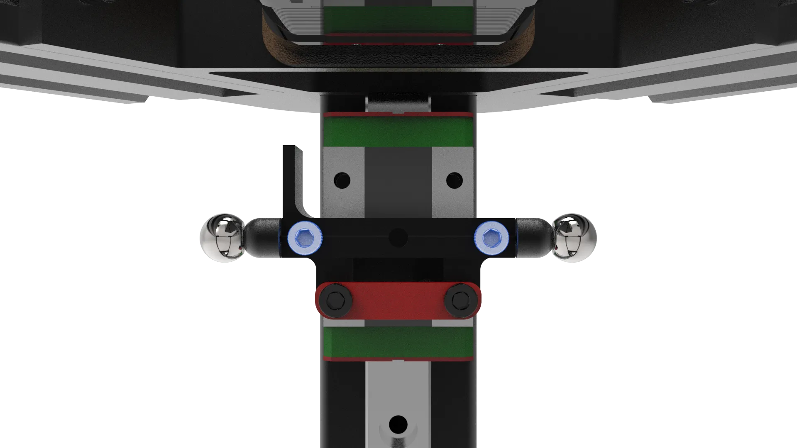{.img1}

5.将<strong>滑块装饰块</strong>卡入到<strong>金属连接滑块</strong>上，如图所示。
   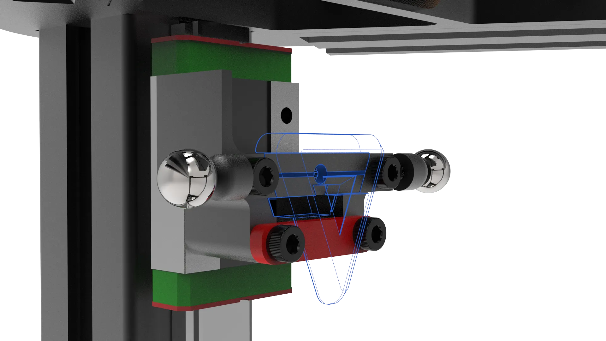{.img1}
   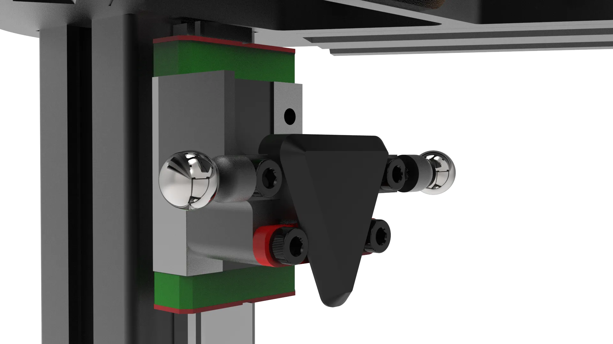{.img1}

6.另外两组安装方法相同。
   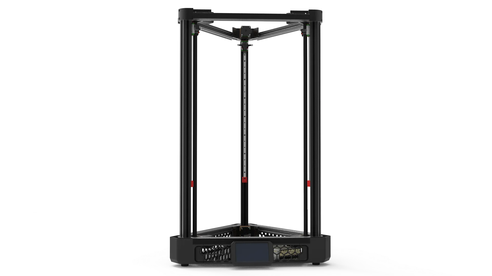{.img1}

  
## 3.传动调节

### 所需物料

1.扭力弹簧 * 3
   {.img1}

2.扎带 * 3
   {.img1}

### 打印零件

1.[皮带松紧调节件] * 3
[皮带松紧调节件]: dy5.stl
   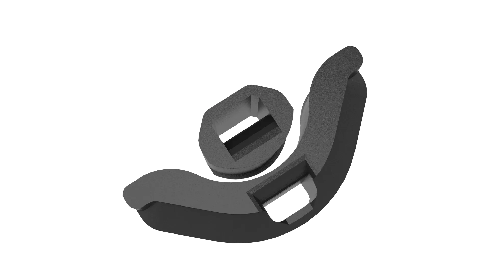{.img1}

### 组装流程

1.将<strong>皮带松紧调节件</strong>与<strong>2GT开口同步带</strong>如图所示连接。
   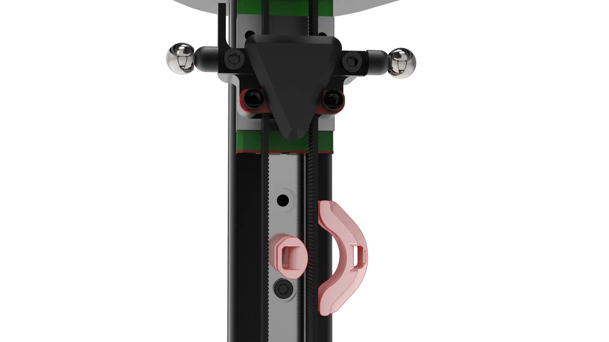{.img1}

2.使用<strong>扎带</strong>拉紧<strong>皮带松紧调节件</strong>使<strong>2GT开口同步带</strong>紧绷。
   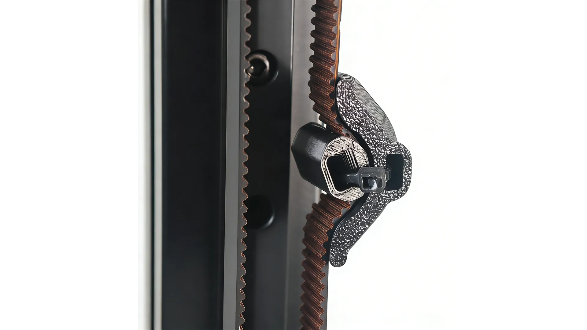{.img1}
   
3.上下滑动<strong>金属连接滑块</strong>观察<strong>2GT开口同步带</strong>运动过程中是否会卡同步轮边缘，如图所示。
   {.img1}
   {.img1}

4.可调节<strong>步进电机</strong>的上下任意平行的两颗螺丝的松紧改变<strong>步进电机</strong>角度，使<strong>2GT开口同步带</strong>运动过程中不会摩擦<strong>步进电机</strong>的同步轮边缘。
   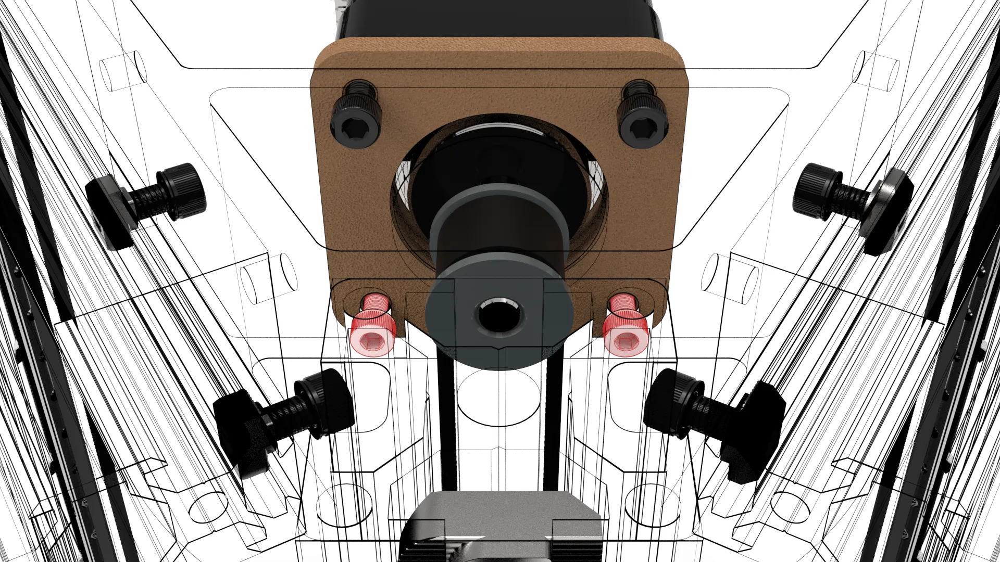{.img1}
   {.img1}

5.最后如图所示位置安装<strong>扭力弹簧</strong>使具有一定自预紧力。
   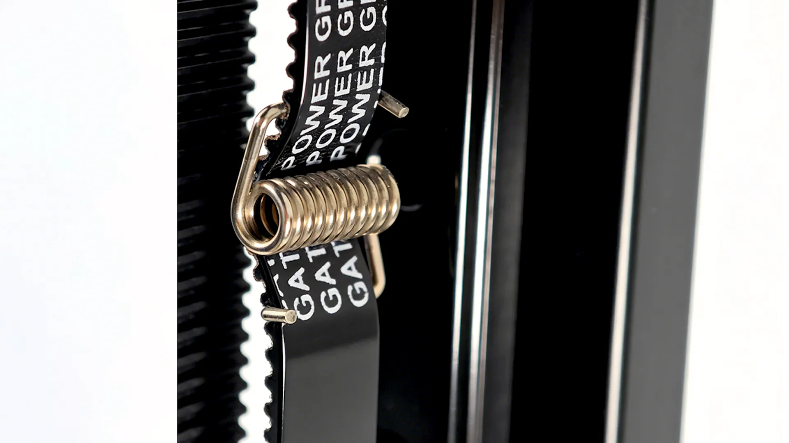{.img1}

   
???- tip "另一种皮带安装方法"

    这是另一种<strong>2GT开口同步带</strong>安装方法，原始的设计本应如此，更换为更加粗壮结实的同步带规格，最高支持到10MM宽度。
    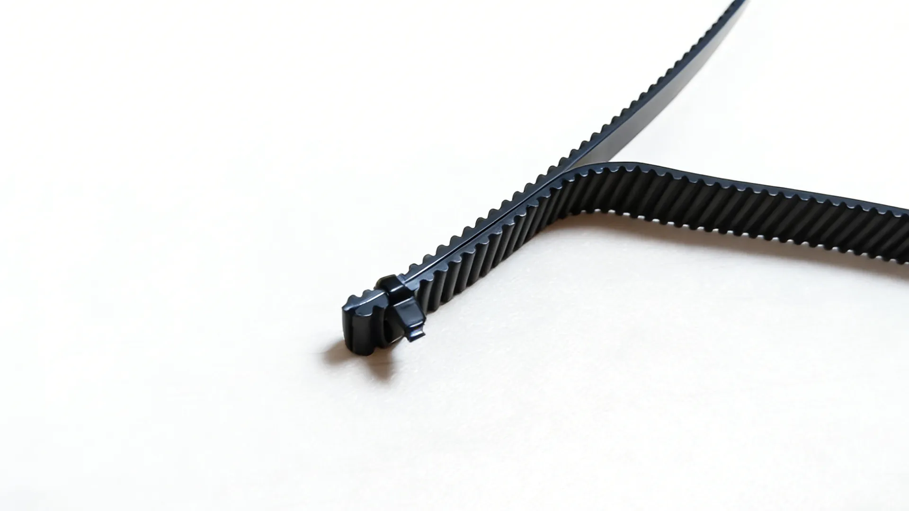{.img1}
    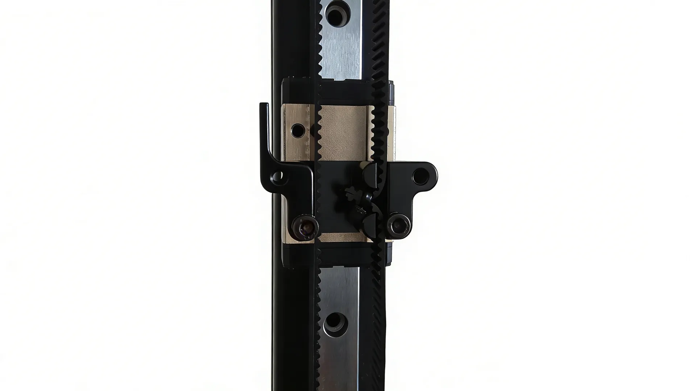{.img1}
    使用另一种MGN滑块可以无需安装滑块垫片直接即可固定，因为量产的<strong>直线导轨</strong>变更，为了不额外增加螺丝种类才做了打印件进行抬升。（注意：如果不使用打印件而是直接进行螺丝固定，<strong>M3*20 杯头螺丝</strong>需要涂抹螺纹胶使其更加紧固。）