## 0.线路连接

!!! warning "警告"

    接线过程中请勿带电操作，会对您的人身安全的造成损害。

    详细对照接线图进行接线，尤其注意供电线路，接线错误会造成不可逆的电器损坏。

!!! info "接线图"
    点击查看完整[<strong>接线图</strong>]。
    [<strong>接线图</strong>]: jxt.pdf

    {.img1}

## 1.接线说明

### 开关电源

1.电源开关线：
   {.img1}

2.接线说明：
   {.img1}

### 耐高温线

1.耐高温线：
   {.img1}

2.接线说明：
   {.img1}

### 粗红黑线

1.粗红黑线：
   {.img1}

2.接线说明：
   {.img1}

### 细红黑线

1.细红黑线：
   {.img1}

2.接线说明：
   {.img1}

### TYPE-C线

1.TYPE-C线：
   {.img1}

2.接线说明：
   {.img1}

!!! tip "提示"
    当您完成接线后，请先检查线路再进行通电测试，确定无误后再继续进行后面的组装，这样会节省您宝贵的时间。

    !!! info "信息"
        如果您购买的是套件，按照接线图进行接线即可正常使用，无需额外的设置，确保接线正确并通电测试后再进行后面的组装。

    !!! danger "注意"
        ==详细对照[<strong>接线图</strong>](jxt.pdf)进行接线，尤其注意供电线路，接线错误会造成不可逆的电器损坏。==

        ==更换任何线路或接口时请务必完全关闭电源后再进行操作，任何线路的热插拔动作均会造成不可逆的电器损坏。==
         

## 2.线材整理

### 所需物料

1.扎带
   {.img1}

### 打印零件

1.[TYPE-C线卡扣]
[TYPE-C线卡扣]: dy9.stl
   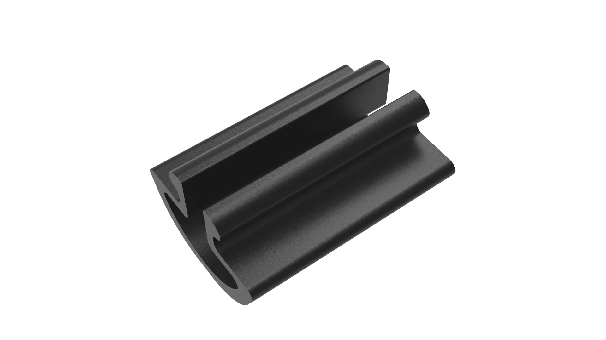{.img1}

2.[2020型材卡扣]
[2020型材卡扣]: dy1.stl
   {.img1}

3.[3030型材卡扣]
[3030型材卡扣]: dy2.stl
   {.img1}

### 组装流程

1.将<strong>热床</strong>卡入<strong>后侧热床挡板</strong>的凹槽中，进行接线操作，使用<strong>扎带</strong>整理线材并剪去多余部分,如图所示。
   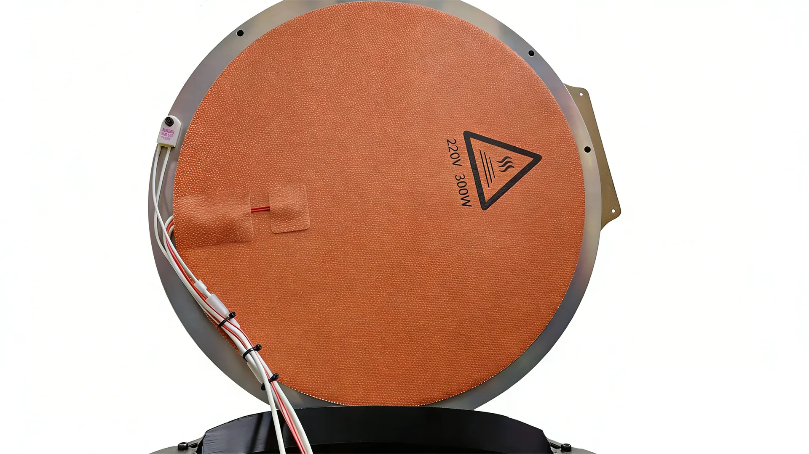{.img1}

2.将<strong>TYPE-C线</strong>卡入<strong>TYPE-C线卡扣</strong>中，如图所示。
   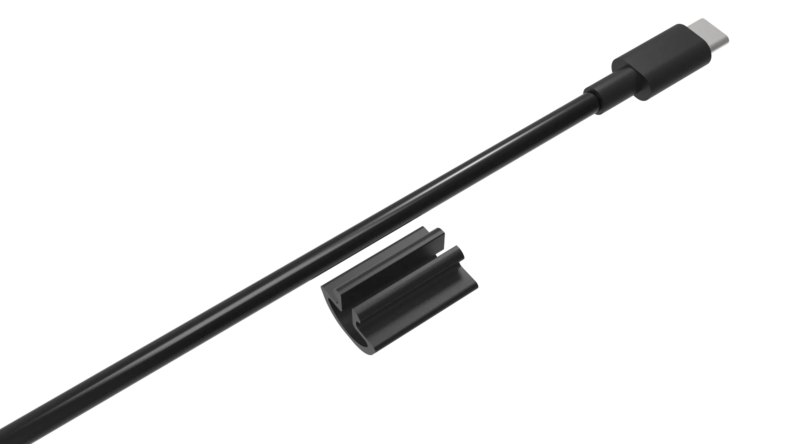{.img1}
   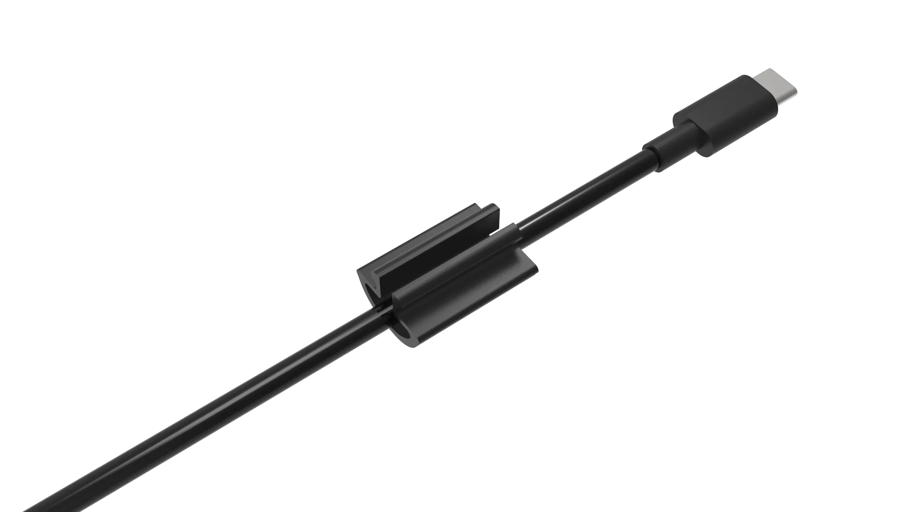{.img1}

3.将线穿过<strong>下脚件装饰件</strong>过线孔中并从上拉出，再穿入<strong>下脚件装饰件</strong>过线孔中并从<strong>步进电机</strong>处拉出，如图所示。
   {.img1}
   {.img1}

4.使用<strong>3030型材卡扣</strong>将线卡入到<strong>长铝型材</strong>上，如图所示。
   {.img1}
   {.img1}

5.使用<strong>2020型材卡扣</strong>将线卡入到<strong>短铝型材</strong>上，如图所示。
   {.img1}
   {.img1}
   {.img1}

6.使用<strong>TYPE-C线卡扣</strong>将<strong>TYPE-C线</strong>卡入到<strong>短铝型材</strong>上，如图所示。
   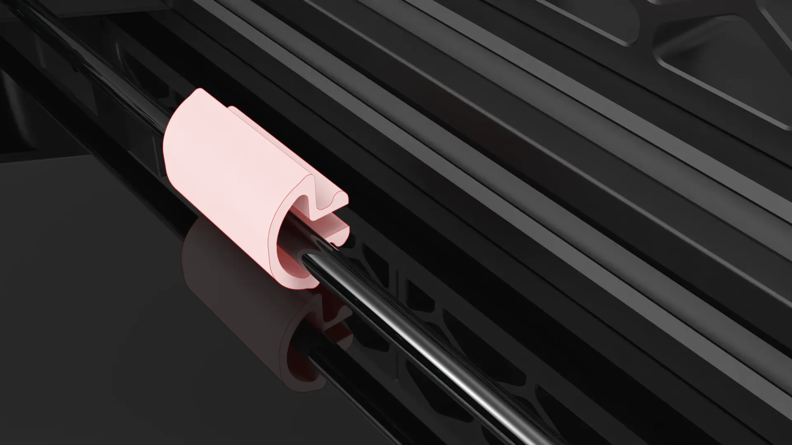{.img1}
   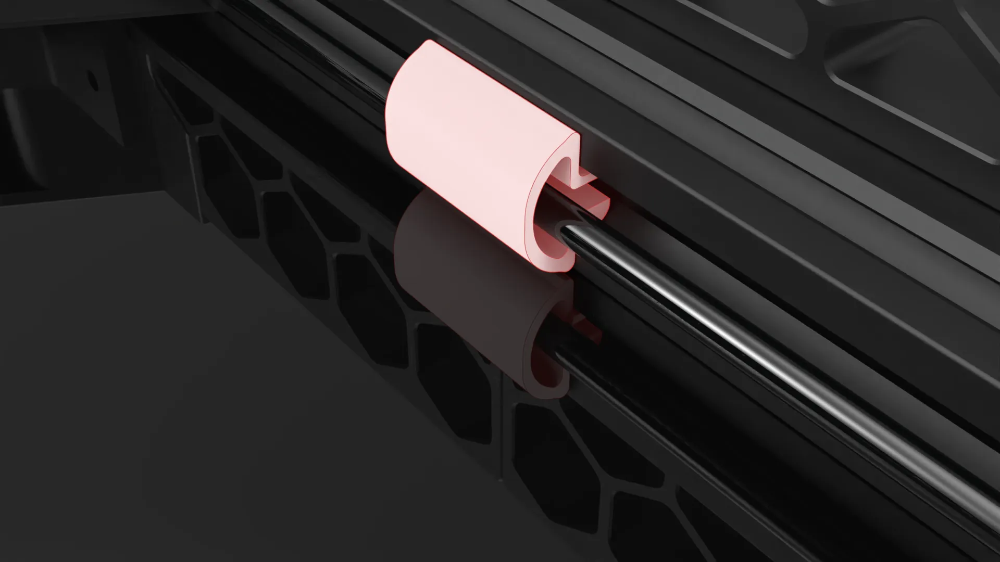{.img1}
   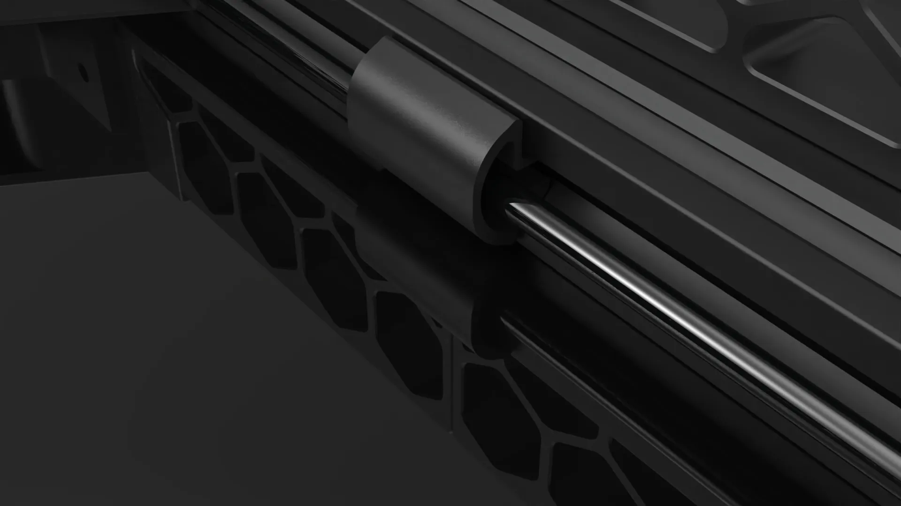{.img1}

!!! info "打印数量"
    <strong>扎带</strong>与<strong>打印件</strong>的数量根据自己的喜好决定，嫌麻烦可以不用理线，这只是为了美观，一般线材不杂乱即可，<strong>打印件</strong>可在切片软件中根据自己理线需求，修改长度。

## 3.挡边组装

### 所需物料

1.M4*10 杯头螺丝 * 24
   {.img1}

2.船型螺母30型-M4 * 24
   {.img1}

### 打印零件

1.[上下挡边] * 6
   [上下挡边]: dy3.stl
   {.img1}

2.[中间挡边] * 6
   [中间挡边]: dy4.stl
   {.img1}

### 组装流程

1.将<strong>上下挡边</strong>与<strong>中间挡边</strong>进行扣合，注意此结构为榫卯结构，圆形卡扣需全部卡入圆形凹槽中，如图所示。
   {.img1}
   {.img1}
   {.img1}

2.使用相同方法再扣合一组，如图所示摆放。
   {.img1}

3.扣入到<strong>长铝型材</strong>中，如图所示。
   {.img1}
   {.img1}

4.将<strong>M4*10 杯头螺丝</strong>拧入<strong>船型螺母30型-M4</strong>，不要拧紧，拧上即可，如图所示。
   {.img1}

5.将螺丝放入<strong>长铝型材</strong>的卡槽中，向下滑动螺丝使能卡入<strong>上下挡边</strong>的槽中，拧好螺丝，如图所示。
   {.img1}
   {.img1}
   {.img1}
   {.img1}
   {.img1}

!!! warning "注意"
    注意<strong>船型螺母30型-M4</strong>的位置，应卡在<strong>长型材的</strong>凹槽内，不要拧的过紧，以免拧坏打印件。
       {.img1}

6.相同方法，螺丝放入<strong>长铝型材</strong>的卡槽中，向上滑动螺丝使能卡入<strong>中间挡边</strong>的槽中，拧好螺丝，如图所示。
   {.img1}

!!! warning "注意"
    注意<strong>船型螺母30型-M4</strong>的位置，应卡在<strong>长型材的</strong>凹槽内，不要拧的过紧，以免拧坏打印件。
       {.img1}

7.另外两颗螺丝安装方法相同，如图所示。
   {.img1}

8.另外一边安装方法相同，如图所示。
   {.img1}

9.另外两组安装相同，如图所示。
   {.img1}

!!! info "配色参考"

    可根据你的喜好，自定义外观:
    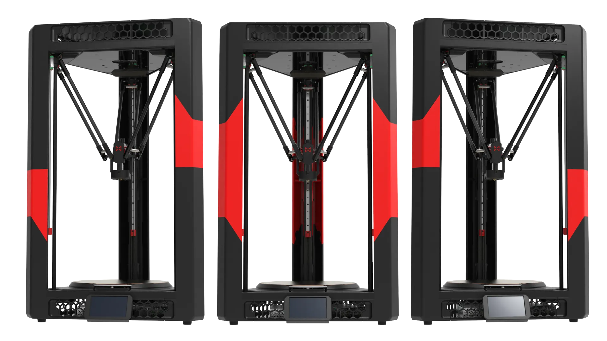{.img1}
    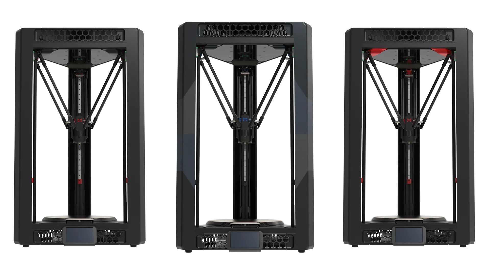{.img1}

## 4.风扇组装

### 所需物料

1.4010散热风扇 * 2
   {.img1}

2.M3*14 杯头螺丝 * 4
   {.img1}

### 打印零件

1.[风扇支架] * 1
   [风扇支架]: dy5.stl
   {.img1}

### 组装流程

1.将四颗<strong>M3*14 杯头螺丝</strong>穿过<strong>4010散热风扇</strong>拧到<strong>风扇支架</strong>上，不要拧的过紧，以免拧坏打印件，如图所示。
   {.img1}
   {.img1}
   {.img1}

2.将<strong>风扇支架</strong>固定到<strong>下位机主板</strong>上，如图所示。
   {.img1}

## 5.消音组装

### 打印零件

1.[消音器] * 1
   [消音器]: dy10.stl
   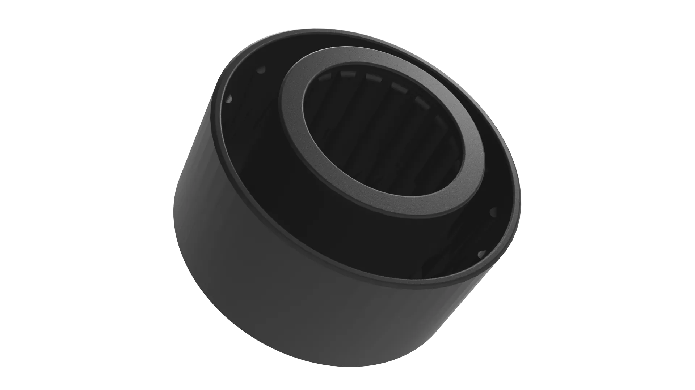{.img1}

1.[消音环] * 1
   [消音环]: dy11.stl
   {.img1}

### 组装流程

1.打印<strong>消音环</strong>时，切片软件中请将顶层与底层的层数设置为<strong>0</strong>，更改填充密度可改变进风量，如图所示。
   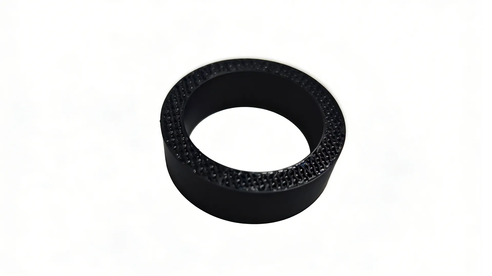{.img1}

2.将<strong>消音环</strong>装入<strong>消音器</strong>中，如图所示。
   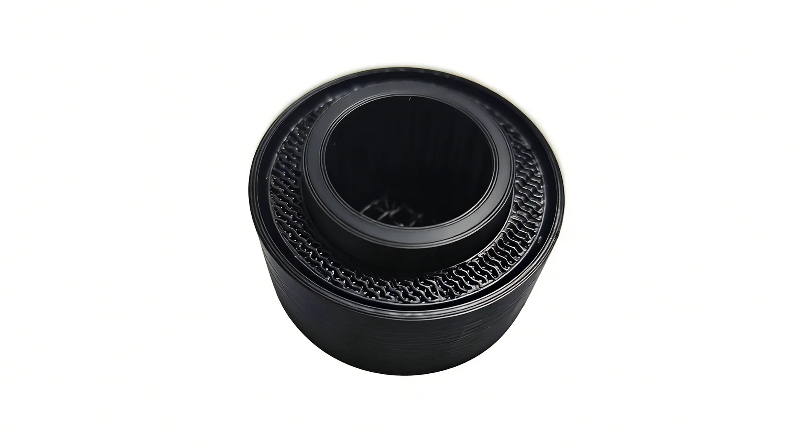{.img1}

3.<strong>消音环</strong>可以不用打印，可使用<strong>眼镜布或干燥的湿巾</strong>代替，如图所示。
   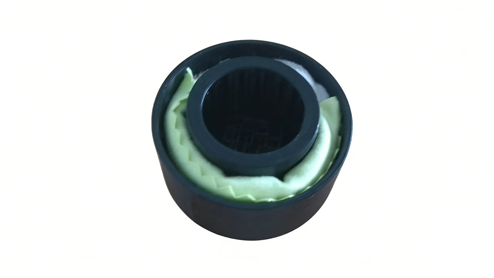{.img1}

4.将<strong>消音器</strong>的圆环卡入<strong>CPAP风扇</strong>的进风口中，如图所示。
   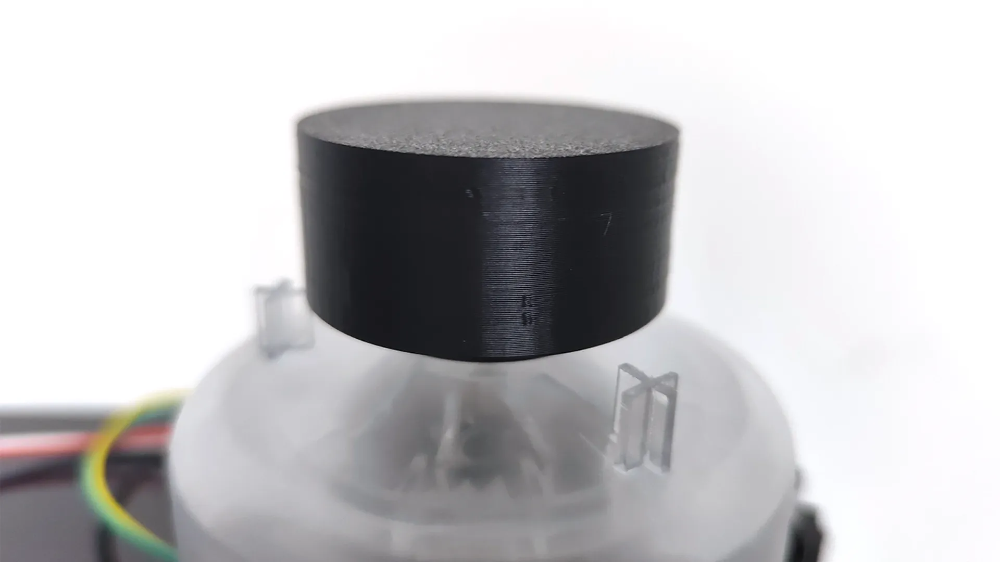{.img1}

!!! tip "提示"
    为了追求更快的散热效果，可以不安装<strong>消音器</strong>，不过建议你安装<strong>消音器</strong>，这能有效减少噪音，使用<strong>消音环或增加过滤材料</strong>时会影响进风量，但是这个<strong>CPAP风扇</strong>有着接近<strong>三万转</strong>的转速，所以不用担心。

    使用<strong>眼镜布</strong>或干燥的湿巾、一次性的面巾，容易获得且能减少进风量的柔软布料塞入<strong>消音器</strong>中，这不仅能<strong>减少噪音</strong>，同时还能<strong>过滤灰尘</strong>，从而延长<strong>CPAP风扇</strong>的寿命。

## 6.盖板组装

### 所需物料

1.四氟管 * 1
   {.img1}

2.M3*8 沉头螺丝 * 4
   {.img1}

3.滚花螺母 * 3
   {.img1}

### 打印零件

1.[盖板连接件] * 1
   [盖板连接件]: dy6.stl
   {.img1}

2.[盖板打印件] * 3
   [盖板打印件]: dy7.stl
   {.img1}

3.[耗材支架] * 3
   [耗材支架]: dy8.stl
   {.img1}

### 组装流程

1.将<strong>四氟管</strong>裁剪出一段<strong>90MM</strong>长度的短管，插入到<strong>底板连接件</strong>中，如图所示。
   {.img1}
   {.img1}
   {.img1}
   {.img1}
   
2.使用烙铁将三颗<strong>滚花螺母</strong>压入<strong>盖板连接件</strong>中，如图所示。
   {.img1}
   {.img1}

3.使用两颗<strong>M3*8 沉头螺丝</strong>将两片<strong>盖板打印件</strong>与<strong>盖板连接件</strong>进行锁紧，如图所示。
   {.img1}
   {.img1}
   {.img1}

4.放入到打印机顶部，<strong>四氟管</strong>穿过<strong>盖板连接件</strong>，如图所示。
   {.img1}

5.放入<strong>盖板打印件</strong>使用<strong>M3*8 沉头螺丝</strong>将<strong>盖板打印件</strong>与<strong>盖板连接件</strong>进行锁紧，如图所示。
   {.img1}

6.使用<strong>M3*8 沉头螺丝</strong>将所有<strong>盖板打印件</strong>锁紧，如图所示。
   {.img1}
   {.img1}

7.可将<strong>耗材支架</strong>放置在侧边或顶部，装置耗材，愉快打印。
   {.img1}
   {.img1}

???- question "FAQ"

    **Q: 为什么盖板连接件要这样设计？**

    **A:** 为保证高自由度和可复制性，所有的打印件均能本机完成打印，所以对设计进行了拆件，同时拆分后打印以及维护也将更加容易。

    **Q: 可以封箱么？**

    **A:** 可以，需要增加额外的材料和少量的改动即可实现封箱，不会损失任何打印尺寸，我将在完善后发布。
